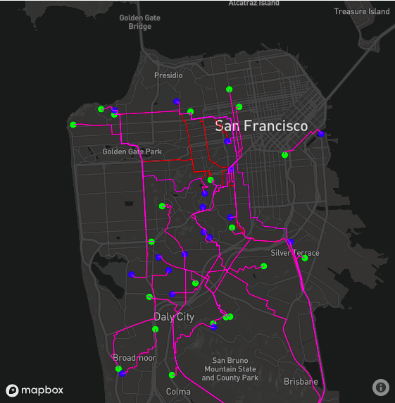
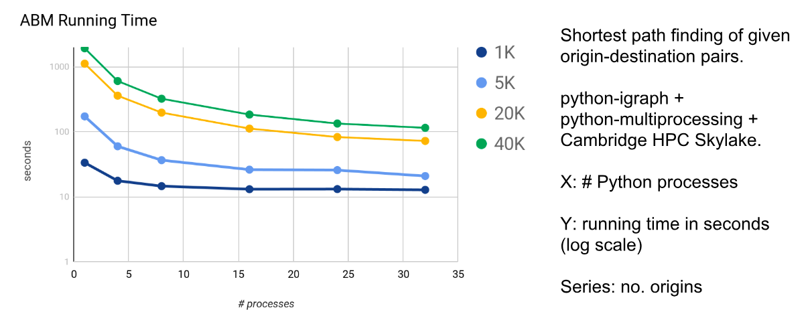

# sf_abm
* Creating the street network graph for a city (San Francisco as an example) directly from [OpenStreetMap (OSM)](openstreetmap.org);
* Generating node-level Origin-Destination (OD) pairs in San Francisco from Traffic Analysis Zone level data;
* Simulating the traffic movements in the study area with Agent Based Model (ABM). It can easily simulate the movements of millions of agents if run in parallel, using python multiprocessing and High Performance Computers (HPC).

### Code structure
To run the ABM simulation, you will need to run through each of the following folder:
  * [`0_network`](0_network): downloading the OSM street network and constructing a graph (nodes and links) for the study area;
  * [`1_OD`](1_OD): generating the hourly OD matrices based on data based on SFCTA's [TNC study](http://tncstoday.sfcta.org) (Uber/Lyft pick-ups and drop-offs). Origins and destinations are nodes in the graph;
  * [`2_ABM`](2_ABM): finding the shortest path for each OD pair using [python-igraph](http://igraph.org/python/), [sp](https://github.com/cb-cities/sp) and [python-multiprocessing](https://docs.python.org/3.4/library/multiprocessing.html?highlight=process). The code can run on multi-core PC or HPC.

### Performance
  * The most time consuming part of the ABM is finding the shortest path for each agent. In order to speed up the shortest path computation for thousands or even millions of agents:
  	* we are developing our own shortest path implementation [sp](https://github.com/cb-cities/sp);
  	* we use the multiprocessing+HPC in python to parallel the routing part for each agent in, e.g., 32 threads.
  * On a network with 370,000 vertices, 700,000 edges, running on a 32-CPU node (6GB per CPU), it takes 47 minutes in total to run the ABM with 1 million agents.
  * On the same graph and computing hardware, it takes less than 2 minutes to run the ABM for 40,000 agents, roughly 17 times faster than running on single thread.
  